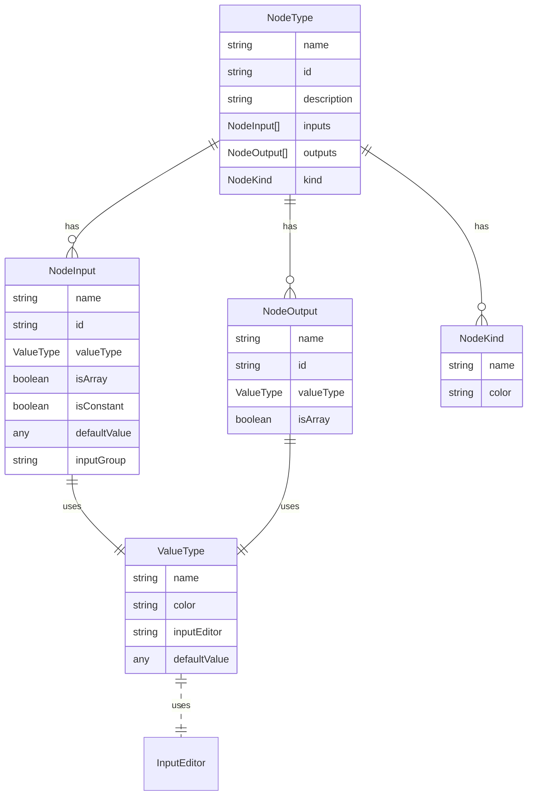

# Documentation

## NodeType

A node type describes a kind of node that can put in a graph. It has a name and a list of inputs and outputs that have handles to connect to other nodes via edges.

## NodeInput

A node input is a handle that can be connected to a node output via an edge. 

