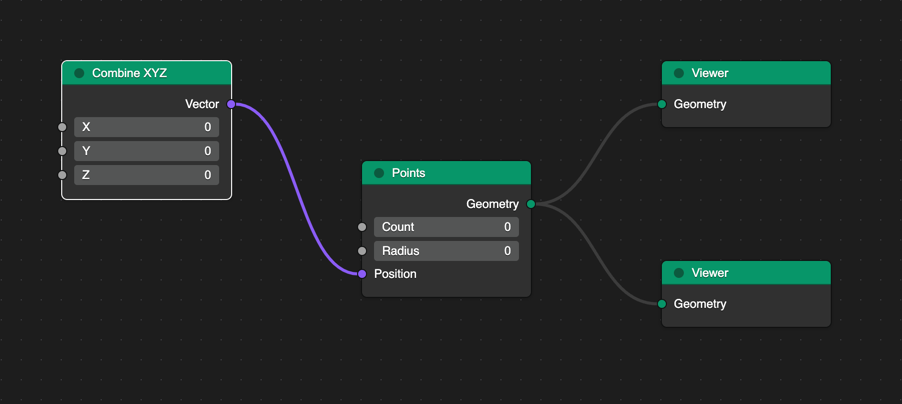

# ngraph
A blender-style node editor built on [xyflow](https://github.com/xyflow/xyflow). Try it out in [Storybook](clarkmcc.github.io/ngraph/).

## Features
* Declarative config-based node creation.
* Custom node types using React components when the declarative approach is insufficient.
* Color-coded node groups, value types, and connections.
* Clipboard support for nodes and connections.
* Many input types supported including text input, checkboxes, button groups, and select dropdowns.
* Multiple socket shapes supported including square, circle, and diamond.
* Property-as-inputs allow you to set the value directly, or connect it to the output of another node.
* Built-in support for Dagre layout engine.

## Credits
The design for this project is taken almost entirely from the [roman01la/threegn](https://github.com/roman01la/threegn) (now in maintenance mode).
